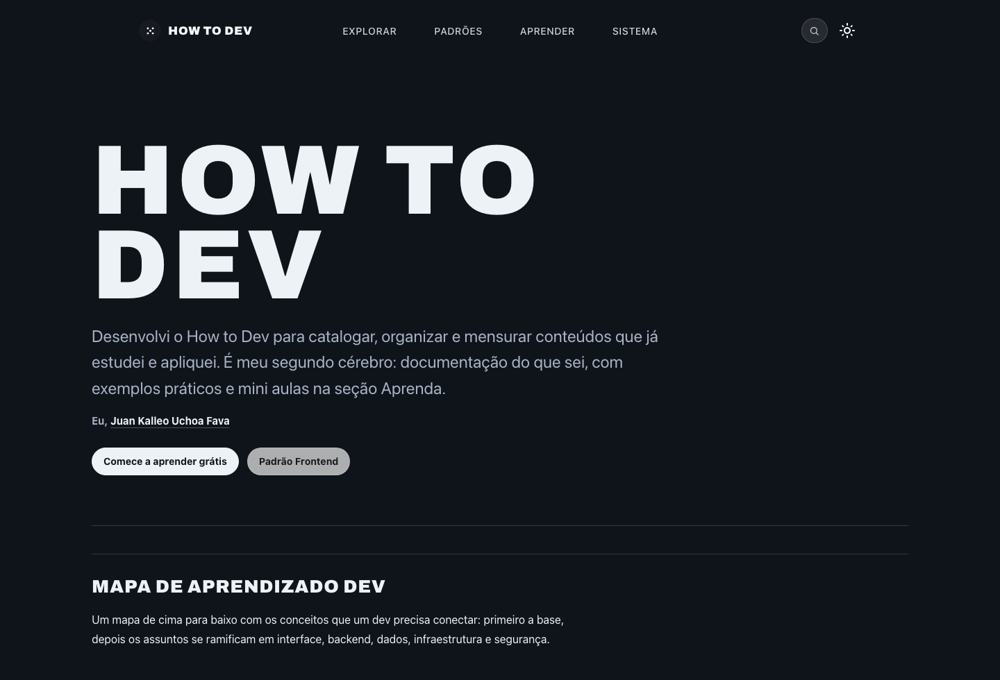
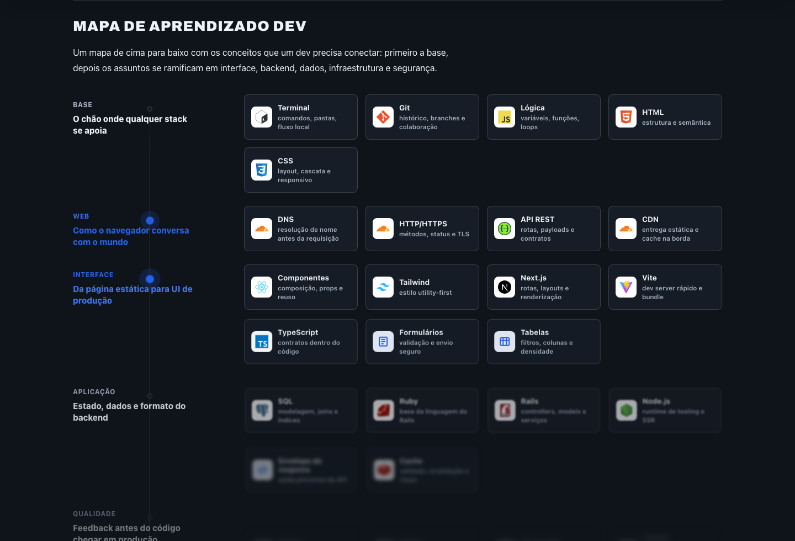
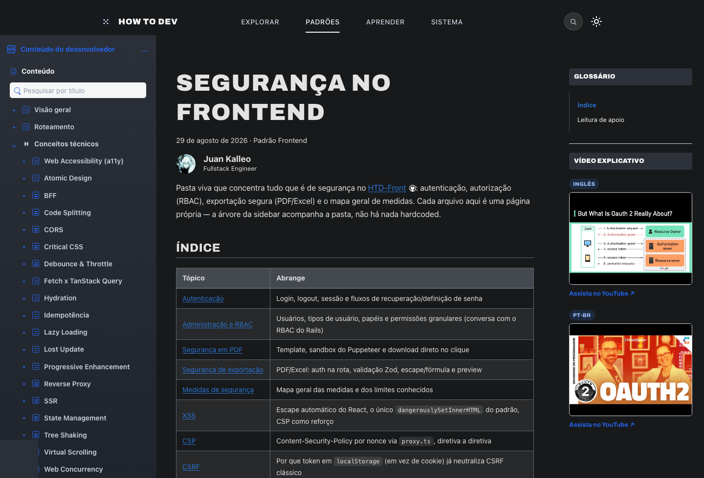

# How to Dev

[](https://github.com/juankalleo)
[](https://nextjs.org)
[](https://pnpm.io)

**How to Dev** é uma base de conhecimento pessoal para catalogar, organizar e mensurar conteúdos que já estudei e apliquei em desenvolvimento de software.

O projeto reúne guias práticos sobre frontend, APIs, bancos de dados, segurança, infraestrutura, arquitetura e trilhas de estudo. A ideia é funcionar como um segundo cérebro: uma documentação pública, navegável e pesquisável sobre decisões técnicas, padrões de implementação e exemplos de aplicação.

## Prévia

### Tela inicial



### Mapa de aprendizado



### Páginas de documentação



## O Que Tem No Projeto

| Área | Rota | Objetivo |
| --- | --- | --- |
| Aprenda | `/aprenda` | Trilhas práticas para estudar fundamentos e tecnologias. |
| Padrão Frontend | `/padrao-frontend` | Estrutura, componentes, segurança, cache, tabelas, relatórios e tecnologias frontend. |
| Padrão API | `/padrao-api` | Contratos HTTP, roteamento, versionamento, erros, paginação e segurança de API. |
| Padrão Banco de Dados | `/padrao-banco-de-dados` | Modelagem, migrations, multi-tenancy, auditoria e convenções de schema. |
| Padrão Infraestrutura | `/padrao-infraestrutura` | Linux, rede, Docker, Nginx, deploy, CI/CD e operação. |
| Exemplos | `/examples` | Catálogo de exemplos e fluxos práticos. |
| Créditos | `/creditos` | Fontes, livros, canais e documentações usados como referência. |

## Estrutura

```txt
src/
  app/                  Rotas, layout global, estilos e metadados
  components/           Navbar, sidebar, markdown, busca, aulas e blocos visuais
  content/aprenda/      Trilhas e lições práticas
  lib/                  Leitura dos docs, SEO, busca, idioma e progresso local

docs-frontend/          Conteúdo do Padrão Frontend
docs-api/               Conteúdo do Padrão API
docs-banco-de-dados/    Conteúdo do Padrão Banco de Dados
docs-infraestrutura/    Conteúdo do Padrão Infraestrutura
docs-examples/          Conteúdo de exemplos

public/img/readme/      Capturas usadas neste README
```

Os arquivos Markdown em `docs-<area>/` viram páginas automaticamente pelo roteamento dinâmico do Next.js. A árvore lateral, a busca global e o sitemap usam essa mesma fonte de conteúdo.

## Stack

- Next.js 16
- React
- TypeScript
- pnpm
- Tailwind CSS
- React Markdown
- rehype-highlight
- cmdk para busca global
- Playwright para validações visuais pontuais

## Rodando Localmente

```sh
corepack pnpm install
corepack pnpm run dev
```

Depois abra:

```txt
http://localhost:3000
```

Build de produção:

```sh
corepack pnpm run build
corepack pnpm run start
```

## Idioma E Conteúdo

A interface principal usa PT-BR por padrão e mantém alternância para inglês. O conteúdo técnico principal ainda nasce em português, porque este projeto documenta diretamente o que foi estudado, aplicado e revisado no meu próprio fluxo.

## SEO E Indexação

O site é público e indexável. Ele inclui:

- `sitemap.xml` gerado a partir das rotas reais
- metadados por página
- Open Graph/Twitter metadata
- imagem social gerada em `src/app/opengraph-image.tsx`
- dados estruturados para site, pessoa, artigo e breadcrumbs

## Segurança

O How to Dev já foi protegido por HTTP Basic Auth, mas essa proteção foi removida quando o objetivo passou a ser uma base pública e indexável. Ainda assim, headers básicos como `X-Frame-Options`, `X-Content-Type-Options` e `Referrer-Policy` continuam aplicados.

A seção de segurança existe com uma régua clara: documentar o suficiente para explicar o funcionamento real sem esconder decisões importantes. A proteção esperada vem de arquitetura, autorização, validação e limites bem definidos, não de obscuridade.

## Manutenção

Este é um projeto pessoal mantido por [Juan Kalleo](https://github.com/juankalleo). Não é um projeto aberto com roadmap de comunidade, mas o repositório é público para leitura, estudo, referência e adaptação.

## Licença

Conteúdo pessoal. Nenhuma licença de reutilização foi definida.
